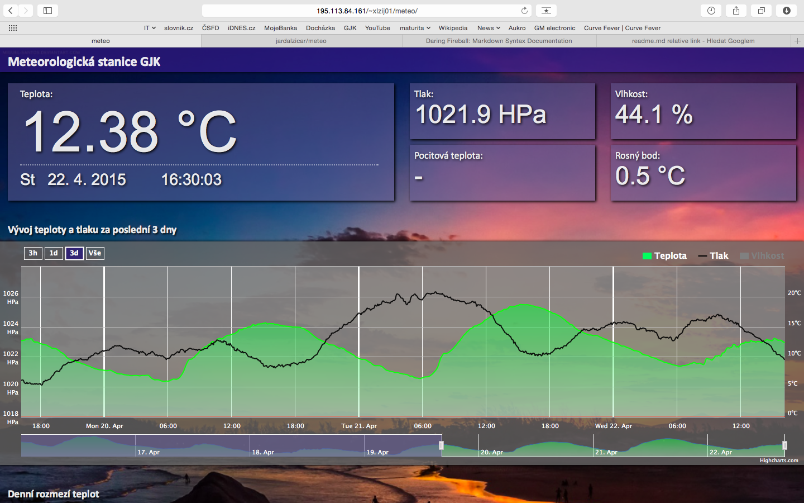
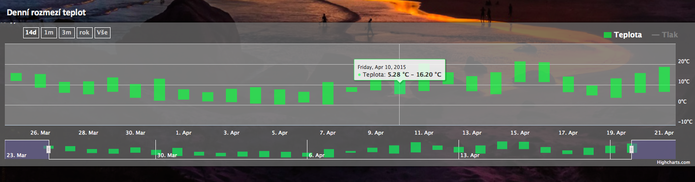
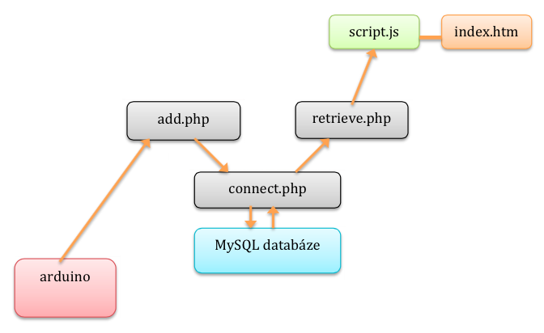
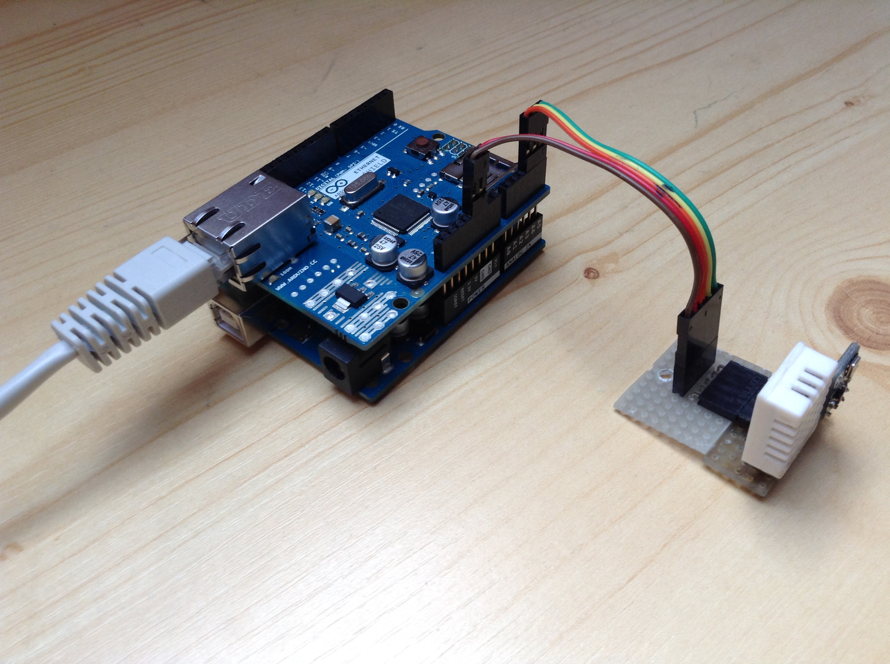
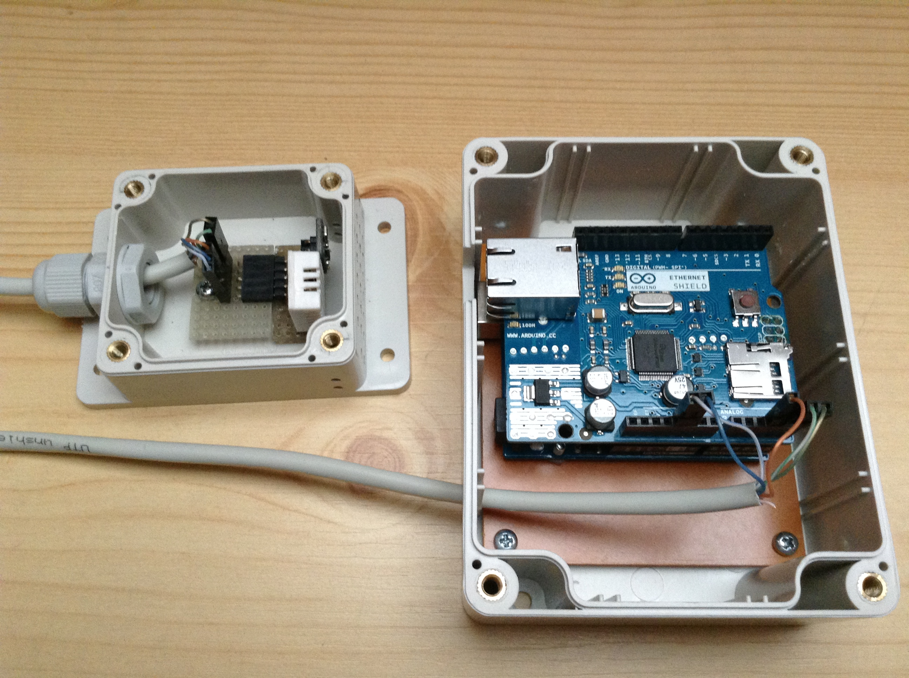
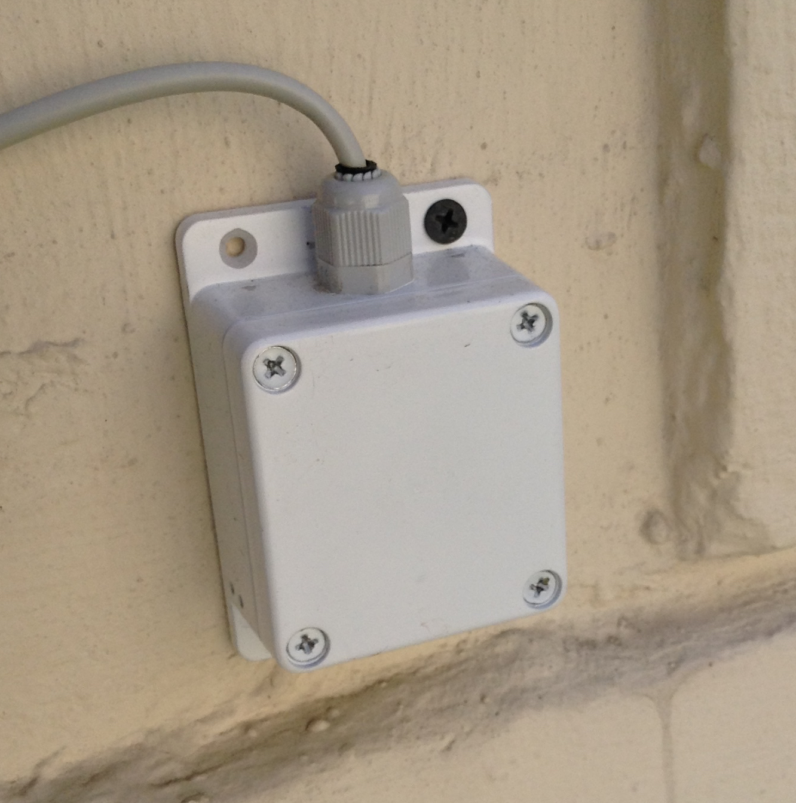

# Školní meteorologická stanice

Jednoduchá meteorologická stanice založená na platformě [arduino](http://www.arduino.cc), která měří teplotu, tlak a vlhkost vzduchu, tato data ukládá do databáze a následně zobrazuje přes webovou aplikaci.

- **Aktuální verze:** <http://gjk.cz/~xlzij01/meteo/>
- **Ukázka:** [screenshoty](screenshots)
- **Dokumentace:** [dokumentace projektu v pdf](dokumentace.pdf) 
- **Repozitář:** [jardalzicar/meteo](https://github.com/jardalzicar/meteo) + [fork](https://github.com/gjkcz/meteo) v archivu maturitních prací
- **Autor:** Jaroslav Lžičař, <jarda.lzicar@seznam.cz>
- **Maturitní práce 2014/15** na [GJK](https://github.com/gjkcz/gjkcz)

## Dokumentace pro uživatele

####Aplikaci spustíte kliknutím na [tento odkaz](http://gjk.cz/~xlzij01/meteo/) 
 
Po načtení by měla stránka vypadat následovně

#### Ovládání

V horní části stránky vidíte aktuální hodnoty teploty, tlaku, vlhkosti vzduchu, rosného bodu a pocitové teploty (zobrazuje se pouze při teplotě vyšší než 25 °C).

První graf zobrazuje vývoj teploty (zelená plocha) a tlaku (černá čára) za poslední 3 dny.  
  
  
V levém horním rohu lze vybrat požadovaný rozsah grafu, maximální hodnota je 1 týden. Pro přesnější výběr je možno použít posuvník pod grafem. V pravém horním rohu grafu můžete zvolit, které data budou zobrazena.

Když stránku posunete dolů, naleznete zde druhý graf.

  
Zelené sloupky v něm zobrazují rozdíl maximální a minimální teploty za každý den. Možnosti nastavení jsou stejné jako u horního grafu, maximální rozsah není omezen.      
   

## Dokumentace pro programátory

#### Komponenty
- [Arduino Uno](http://www.arduino.cc/en/Main/arduinoBoardUno)
- [Arduino Ethernet Shield](http://www.arduino.cc/en/Main/ArduinoEthernetShield)
- [BMP180](http://www.adafruit.com/product/1603)
- [DHT22](http://www.adafruit.com/product/385)

#### Rozmístění souborů

Ve složce [senzory](senzory) se nachází soubor se zdrojovým kódem pro arduino, ve složce [www](www) naleznete všechny soubory, které jsou umístěny na serveru.

#### Struktura kódu  
  

Arduino přečte naměřené hodnoty ze senzorů a odešle je na server jako http požadavek souboru `add.php`.  Ten se přes `connect.php` připojí k MySQL databázi a data do ní uloží.  
 
Když uživatel zobrazí stránku, javascript v souboru `script.js` pošle AJAX žádost souboru `retrieve.php`, který se připojí k databázi, taktéž přes `connect.php`, odtud načte  potřebná data a předá je javascriptu ve formátu JSON. Soubor `script.js` potom data předá grafu, který je zobrazí na stránce. Po uplynutí 1 minuty, během které proběhne další měření, je vyslán nový AJAX požadavek a data jsou obnovena.

Pro podrobnější popis vizte [dokumentaci](dokumentace.pdf).

#### Použité frameworky
- [jQuery](http://jquery.com)
- [Highcharts](http://www.highcharts.com)

## Obrázky  

Zapojené arduino  

Komponenty v krabičkách  

Venkovní krabička se senzory  

